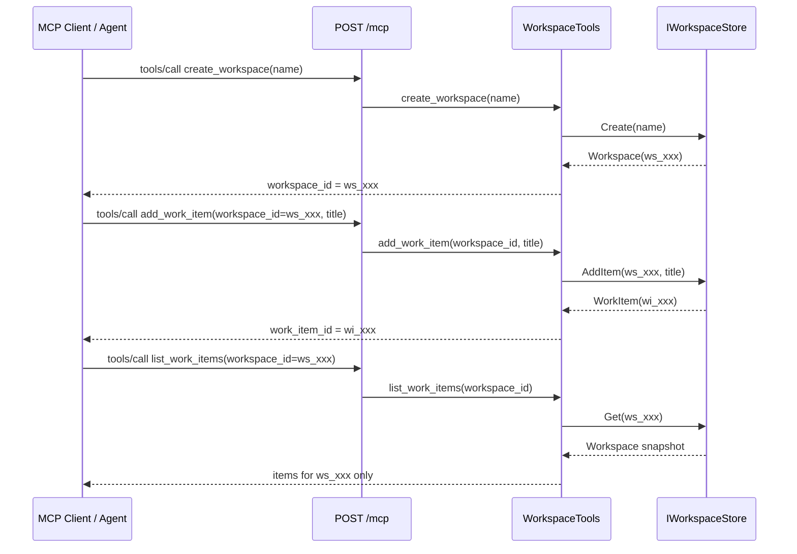

# 架構說明

## 目的

本專案示範 MCP `2026-07-28` 的 **協定層 Stateless** 設計。Server 不保存 MCP Session，也不依賴上一個 HTTP 連線；跨 Tool Call 的工作資料由 Client 每次明確傳入的 `workspace_id` 關聯。

## 請求流程



## 元件責任

| 元件 | 責任 | 不負責 |
| --- | --- | --- |
| `Program.cs` | 註冊 DI、啟用 `Stateless = true`、映射 `/mcp` | 保存「目前 Workspace」 |
| `WorkspaceTools` | 提供四個 Tool、驗證輸入、回傳結構化成功/錯誤結果 | 判斷上一個 Request 的資料 |
| `IWorkspaceStore` | 抽象化 Workspace 資料讀寫 | HTTP 或 MCP Transport 細節 |
| `InMemoryWorkspaceStore` | 單一 process 的 thread-safe Workspace 資料 | 跨 process 持久化、登入、授權 |
| MCP Client | 保存並重複傳遞 Server 回傳的 `workspace_id` | 猜測或省略 Handle |

## 狀態邊界

```text
MCP protocol state:     無 Session、無 Mcp-Session-Id、每個 Request 可獨立處理
Application state:      Workspace / WorkItem 資料仍存在 Store
Explicit state handle:  workspace_id（ws_...）和 work_item_id（wi_...）
```

`workspace_id` 是資料定位用的 opaque handle，不是「目前使用者」或「目前連線」的隱含狀態。下列做法在本專案中刻意不存在：

- HTTP Session 或 Cookie-based current workspace。
- `Mcp-Session-Id`。
- 靜態 `CurrentWorkspace`、`LastWorkspace` 變數。
- 從 Connection ID、Client process ID 推論 Workspace。
- 「找不到 ID 時使用最近一次 Workspace」的備援。

## 隔離與併發

每個 Workspace 以唯一 `ws_` + GUID 建立；Work item 使用獨立 `wi_` + GUID。Store 的 mutable dictionary 和 item list 受單一 `Lock` 保護，因此同一 Workspace 的 20 筆併發新增不會互相覆蓋。讀取回傳 snapshot，Client 不能直接修改內部 list。

目前測試驗證：

- A Workspace 無法從 list 結果看見 B Workspace 的 items。
- 不存在的 `workspace_id` 回傳 `workspace_not_found`。
- 空白 Handle 回傳 `invalid_input`。
- 20 個 concurrent `AddItem` 最終保留 20 筆、ID 不重複。

## 安全邊界：Handle 不是授權

目前作業**沒有登入或授權**。`workspace_id` 難以隨機猜中，但知道 ID 的呼叫者仍可操作該 Workspace。這是教學範圍的刻意限制，不能用於多使用者正式環境。

正式版每個 request 應包含並驗證使用者身分，例如 Bearer Token：

```text
workspace_id + authenticated user / tenant
    -> verify token
    -> load Workspace
    -> compare owner_id or access-control list
    -> allow or return workspace_access_denied
```

即使改為 Stateless，這個授權檢查也應在**每一個** request 執行。還需要 HTTPS、Token 到期/撤銷、審計 log 的 ID 遮罩，以及 rate limit。

## 從教學版走向正式部署

保持 `IWorkspaceStore` 不變，替換實作即可逐步演進：

| 版本 | Store | Server 重啟後 | 多 Instance |
| --- | --- | --- | --- |
| 本作業 | `InMemoryWorkspaceStore` | 資料消失 | 不可共享 |
| 下一步 | SQLite | 可保留 | 不建議多寫入 Instance |
| 正式部署 | Redis / SQL / Cosmos DB 等共享 Store | 可保留 | 可搭配 Load Balancer |

協定無狀態讓任意 request 可以被任意 instance 處理；但 Application State 必須位於所有 instance 都能安全存取的外部資料層，不能誤把本機記憶體稱為可直接水平擴充。
